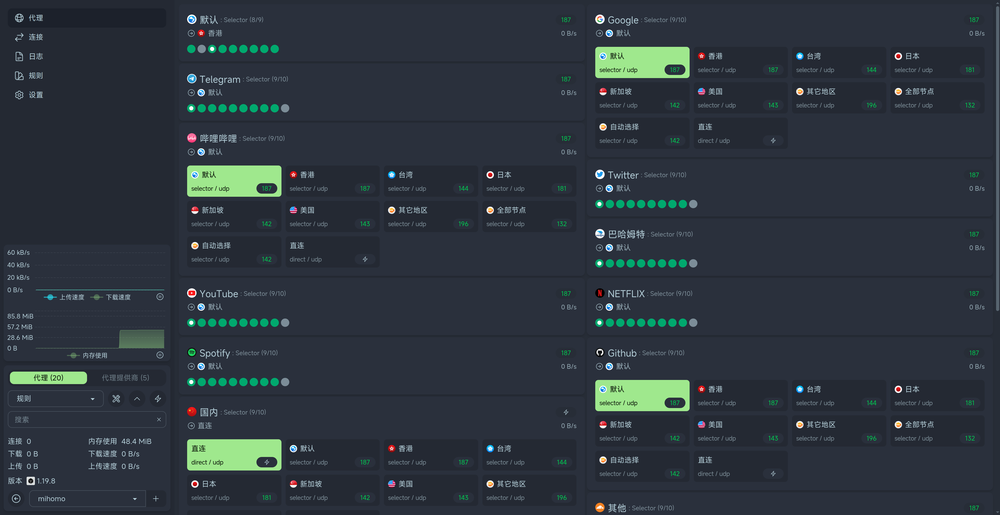
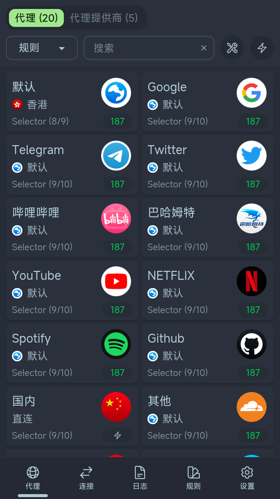

# NebulaDash

NebulaDash 是基于 [Zashboard](https://github.com/Zephyruso/zashboard) 的轻量增强分支，面向 OpenClash / Mihomo 日常使用场景优化。

核心目标是：不引入常驻中转服务或数据库，仍由浏览器直连后端，同时改善多 Provider 配置下代理页加载慢、搜索不稳定、规则链路难定位等问题。

<p align="center">
  
  
</p>

## 项目定位

- 上游来源：`Zephyruso/zashboard`
- 本仓地址：`boostemotion/nebuladash`
- 当前包版本：`2.8.0-nebula.4.2.0`
- 技术栈：Vue 3 + Vite + TypeScript + Tailwind CSS / daisyUI
- 架构：纯前端面板，浏览器直连 OpenClash / Mihomo API

NebulaDash 不是 Zashboard 官方版本。本分支会选择性跟进上游更新，但会优先保留 OpenClash 多 Provider 环境下的本地优化。

## 主要增强

### 代理页加载与分组

- 代理页拆分为三段视图：
  - 策略组
  - 节点组
  - 代理商
- 首屏只依赖 `/proxies`，不再让慢速 `/providers/proxies` 阻塞策略组和节点组。
- Provider 数据只在切到“代理商”标签或手动刷新时请求。
- 代理数据和 Provider 数据增加本地缓存，后端慢时仍能先用缓存起屏。
- 建立“节点 -> Provider”映射，减少界面层重复遍历。

### 搜索增强

- 统一搜索能力：
  - NFKC 规范化
  - 符号容错
  - 多关键词 AND
  - 域名 label 变体
- 代理页搜索支持：
  - 组名匹配
  - 节点名匹配
  - 子节点命中后显示父级策略组 / 节点组
  - 首次输入搜索词时再补拉规则数据，用于规则联动搜索
- 规则页搜索支持链路感知匹配，可通过下游节点筛出上游规则。
- 搜索命中项带高亮，便于确认实际命中位置。

### 规则链路定位

- 策略组卡片支持“规则直通”。
- 可从策略组跳转到对应规则。
- 可点击链路节点切换到目标分段并定位到具体卡片。
- 规则直通末尾显示最终节点所属 Provider，便于确认实际出口来源。

### 构建与低资源设备体验

- 路由懒加载，减少首包压力。
- Vite / Rollup 手动 chunk 拆分，避免所有视图和大依赖一次进入首包。
- 保持纯前端架构，不增加路由器上的 Node / Docker 常驻负担。

### 更新保护

- 面板更新源固定为 NebulaDash Release。
- 如果后端配置的 UI 下载地址不是 `boostemotion/nebuladash` 的 GitHub Release ZIP，面板会禁用“更新面板”，避免误把自己替换成其他面板。

## 下载

最新构建产物：

- [dist.zip](https://github.com/boostemotion/nebuladash/releases/latest/download/dist.zip)
- [router-updater.zip](https://github.com/boostemotion/nebuladash/releases/latest/download/router-updater.zip)
- 当前已发布 Release：[`v2.8.0-nebula.4`](https://github.com/boostemotion/nebuladash/releases/tag/v2.8.0-nebula.4)
- 下一发布目标：`v2.8.0-nebula.4.2.0`

发布和公开仓库隔离规则见：

- [PUBLICATION.md](./PUBLICATION.md)

## OpenClash / Mihomo 更新配置

推荐将 UI 下载地址配置为 NebulaDash Release：

```yaml
external-ui-download-url: https://github.com/boostemotion/nebuladash/releases/latest/download/dist.zip
```

如果希望与原版 Zashboard 共存，可使用不同的 `external-ui-name`：

```yaml
external-ui: /usr/share/openclash/ui
external-ui-name: nebuladash
```

示例访问地址：

```text
http://10.0.0.1:9090/ui/nebuladash/
```

如需切回原版 Zashboard，改回对应的 `external-ui-name` 并重启 OpenClash。

## NebulaDash 自管理更新器

OpenClash LuCI 内置的 Dashboard / Yacd / Metacubexd / Zashboard 按钮不包含 NebulaDash。若希望在
NebulaDash 前端里点击按钮后直接触发路由器脚本更新，可安装本仓的可选路由器端更新器：

- 源码目录：`router-updater/`
- 运行目录：`/usr/share/nebuladash-updater/`
- HTTP 入口：`/www/cgi-bin/nebuladash-updater`
- 面板入口：`/www/nebuladash`
- 部署策略：A/B 分区，失败不切换，支持回滚

更新器会从 NebulaDash GitHub Release 下载：

```text
https://github.com/boostemotion/nebuladash/releases/latest/download/dist.zip
```

前端“更新 NebulaDash”按钮会在更新前检查 latest Release。若无法确认远端版本、远端同版本或远端更旧，会先弹出风险确认；用户确认后仍可继续覆盖安装或回退安装。

OpenWrt/uHTTPd 环境可能不会把自定义请求头传给 CGI。NebulaDash 会同时发送 `X-NebulaDash-Token` header 和 `token` query 参数，路由器端优先读 header，缺失时回退读 query token。

安装和配置见 [router-updater/README.md](./router-updater/README.md)。

## 连接参数

可通过 URL 参数预填后端连接信息：

```text
http://host:port/#/setup?hostname=ipordomain&port=9090&secret=123456
```

支持参数：

- `hostname`：Clash / Mihomo API 地址。
- `port`：Clash / Mihomo API 端口。
- `secret`：API 鉴权密钥。
- `secondaryPath`：可选的后端路径前缀。
- `disableUpgradeCore`：设为 `1` 或 `true` 时隐藏核心升级按钮。

## 浏览器要求

- Chrome 111+
- Firefox 128+
- Safari 16.4+
- 不支持 iOS 16.4 越狱版本

## 使用提示

- 连接表格可用鼠标左键拖动，右键可复制单元格内容。
- 右键点击节点 / 节点组卡片可对节点 / 节点组测速。
- 节点组排序默认基于 GLOBAL 组中的节点顺序；如需自定义顺序，可通过覆盖 GLOBAL 组指定。
- 支持 PWA，可在移动端通过“添加到主屏幕”获得类原生体验。

## 本地开发

本项目使用 `pnpm@10.15.0`。

```bash
pnpm install
pnpm dev
```

常用命令：

```bash
pnpm test
pnpm type-check
pnpm lint
pnpm build
pnpm preview
```

Windows 下也可以使用本仓启动脚本：

```powershell
.\start-za.ps1
```

仅检查环境：

```powershell
.\start-za.ps1 -Check
```

## 维护与上游同步

本分支采用双远程维护模型：

- `upstream`：官方 Zashboard，只拉取
- `origin`：NebulaDash 自仓，只推送

上游跟进资料：

- [upstream-followup/AI-HANDOFF.md](./upstream-followup/AI-HANDOFF.md)：新对话 / 其他 AI 接手入口
- [README-改动说明.md](./README-改动说明.md)：本分支二改功能说明
- [upstream-followup/NEBULADASH-CHANGELOG.md](./upstream-followup/NEBULADASH-CHANGELOG.md)：NebulaDash 实际维护更新日志
- [upstream-followup/NEBULADASH-ITERATION-PLAN.md](./upstream-followup/NEBULADASH-ITERATION-PLAN.md)：后续迭代计划
- [upstream-followup/UPSTREAM-FEATURES.md](./upstream-followup/UPSTREAM-FEATURES.md)：上游差异和可跟进功能

同步上游时的固定原则：

- 不直接覆盖代理页、规则页、搜索、Provider 缓存相关本地逻辑。
- 上游更新先筛选，再手动融合。
- 每次本地改动都要写入 NebulaDash 维护更新日志。

## 验证基线

提交前至少执行：

```bash
pnpm test
pnpm type-check
pnpm lint
pnpm build
```

## 致谢

- 原项目：[Zashboard](https://github.com/Zephyruso/zashboard)
- 后端生态：OpenClash、Mihomo / Clash.Meta、sing-box

本项目继承上游 MIT License。
